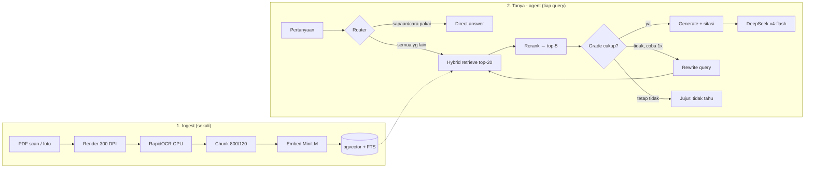
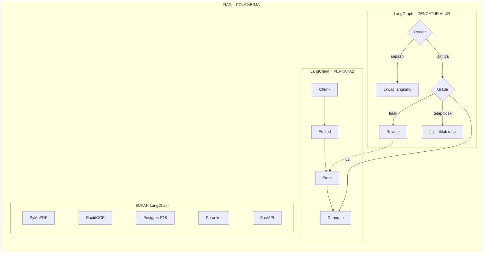

# Arsitektur Porto-AI — OCR + Agentic RAG (v2)

## Alur data

| Tahap | Input → Output | Kode |
|---|---|---|
| Ingest | `scan.pdf` → teks digital langsung, atau render 300 DPI → PNG per halaman scan | `src/ingest/pdf_loader.py::pdf_page_texts`, `pdf_pages_to_images` |
| OCR | PNG → teks + bbox + confidence | `src/ingest/ocr.py::ocr_image` |
| Chunk | teks panjang → potongan 800 char | `src/ingest/chunker.py` |
| Embed+Store | chunk → vektor 384-dim → pgvector | `src/rag/embed_store.py`, `src/ingest/pipeline.py` |
| FTS index | kolom `document` → GIN `tsvector('simple')` + trigram | `scripts/add_fts_index.sql` |
| Router | pertanyaan → `direct` / `rag` | `src/rag/graph.py::router_node` |
| Retrieve | pertanyaan → 20 kandidat (hybrid RRF) | `src/rag/hybrid.py::hybrid_search` |
| Rerank | 20 kandidat → 5 terbaik (cross-encoder) | `src/rag/rerank.py::rerank` |
| Grade/Rewrite | cukup? → generate / tulis ulang 1x / jujur tidak tahu | `src/rag/graph.py::_grade`, `rewrite_node` |
| Generate | konteks + pertanyaan → jawaban + sitasi | `src/rag/chain.py::query` via `graph.agent_answer` |
| Serve | HTTP `/ingest`, `/query` + UI Streamlit | `src/api/main.py`, `ui_app.py` |

## Peta konsep: mana RAG, mana LangChain, mana LangGraph

| Istilah | Peran | Analogi |
|---|---|---|
| **RAG** | Pola kerja: ambil konteks dari dokumen → tempel ke prompt → LLM menjawab | Resep masakan |
| **LangChain** | Perkakas: chunker, embedder, vectorstore, prompt template, LLM wrapper | Peralatan dapur |
| **LangGraph** | Pengatur alur: router, grade, rewrite, loop | Koki yang mengatur langkah |
| **Bukan LangChain** | Render PDF, OCR, FTS database, reranker, API server, UI | Bahan baku + meja dapur |

- **LangChain** = library yang menyediakan komponen: `RecursiveCharacterTextSplitter`, `HuggingFaceEmbeddings`, `PGVector`, `ChatOpenAI` + `Prompt` + `StrOutputParser`.
- **LangGraph** = library pengatur alur agent: `Router`, `Grade`, `Rewrite` loop. Hidup di `src/rag/graph.py` (`langgraph==0.2.28`).
- **Bukan LangChain:** `PyMuPDF` (render 300 DPI), `RapidOCR` (ONNX CPU), `psycopg` (FTS mentah), `sentence-transformers` (reranker), `FastAPI`, `Streamlit`.

Satu kalimat: LangChain menyediakan perkakasnya, LangGraph mengatur alurnya, RAG adalah nama pola keseluruhannya.

## Keputusan desain penting

1. **CPU-first.** OCR (RapidOCR ONNX) + embedding (MiniLM) jalan di CPU. Cuma LLM yang via API. Alasannya: murah, mudah didemo, tanpa GPU.
2. **DeepSeek OpenAI-compatible.** `ChatOpenAI` + `base_url=https://api.deepseek.com/v1`, model `deepseek-v4-flash` dikonfig via `.env`. Ganti model tanpa ubah kode.
3. **pgvector di Docker port 5433.** Laptop sudah ada Postgres bawaan di 5432, jadi container dipindah agar tidak bentrok. Lihat `docs/05-setup-operasi.md`.
4. **Grounding wajib + verifikasi pre-generate.** Prompt memaksa jawab hanya dari konteks + sitasi `[source hal. X]`, dan node `grade` menolak generate kalau konteks tidak mendukung → jawab jujur "tidak tahu". Lihat `docs/02-teknik-rag.md`.
5. **Degradasi aman.** Reranker gagal load (offline) → pakai urutan hybrid. Agent error → fallback hybrid+rerank langsung. Endpoint selalu balas JSON (termasuk saat error 500) agar UI tidak crash.
