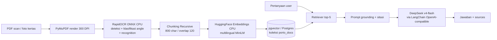

# Arsitektur Porto-AI — OCR + RAG

## Alur data

| Tahap | Input → Output | Kode |
|---|---|---|
| Ingest | `scan.pdf / foto.jpg` → PNG per halaman | `src/ingest/pdf_loader.py::pdf_to_images` |
| OCR | PNG → teks + bbox + confidence | `src/ingest/ocr.py::ocr_image` |
| Chunk | teks panjang → potongan 800 char | `src/ingest/chunker.py` |
| Embed+Store | chunk → vektor 384-dim → pgvector | `src/rag/embed_store.py`, `src/ingest/pipeline.py` |
| Retrieve | pertanyaan → 5 chunk relevan | `src/rag/chain.py::get_chain` |
| Generate | konteks + pertanyaan → jawaban + sitasi | `src/rag/chain.py::query` |
| Serve | HTTP `/ingest`, `/query` + UI Streamlit | `src/api/main.py`, `ui_app.py` |

## Keputusan desain penting

1. **CPU-first.** OCR (RapidOCR ONNX) + embedding (MiniLM) jalan di CPU. Cuma LLM yang via API. Alasannya: murah, mudah didemo, tanpa GPU.
2. **DeepSeek OpenAI-compatible.** `ChatOpenAI` + `base_url=https://api.deepseek.com/v1`, model `deepseek-v4-flash` dikonfig via `.env`. Ganti model tanpa ubah kode.
3. **pgvector di Docker port 5433.** Laptop sudah ada Postgres bawaan di 5432, jadi container dipindah agar tidak bentrok. Lihat `docs/05-setup-operasi.md`.
4. **Grounding wajib.** Prompt memaksa jawab hanya dari konteks + sitasi `[source hal. X]`. Lihat `docs/02-teknik-rag.md`.
